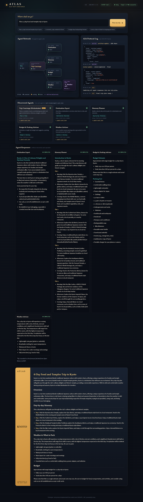

# ✦ ATLAS — a hands‑on **A2A (Agent‑to‑Agent)** prototype

> A small but complete demo that shows **independent AI agents talking to each
> other** over Google's open **A2A protocol** — and lets you *watch them do it*
> live in the browser.

Scenario: **a Smart Trip Planner.** You type something like *“Plan a 5‑day food
and temples trip to Kyoto.”* A **host agent** (the orchestrator) breaks that into
sub‑tasks and hands them to **four specialist agents**, each running as its own
independent web service:

| Agent | Port | What it does |
|---|---|---|
| 🧭 **Destination Expert** | 8101 | Overview of the place, best time to visit, local tips |
| 🗺️ **Itinerary Planner** | 8102 | A day‑by‑day plan matched to your interests |
| 💰 **Budget & Packing Advisor** | 8103 | A rough budget estimate and a packing list |
| 🌦️ **Weather Advisor** | 8104 | Packing advice grounded in a **live forecast** (via an **MCP tool**) |

The host agent then **synthesises** their answers into one polished trip plan.
Every message between agents is real A2A traffic, shown live in the UI.

This prototype also demonstrates two advanced ideas:
- **MCP (Model Context Protocol):** the Weather Advisor doesn’t guess — it calls
  a real weather tool over MCP (backed by the key‑less Open‑Meteo API). That’s
  the *agent‑to‑tool* protocol working alongside the *agent‑to‑agent* one.
- **Agents composing:** the orchestrator is itself a full **A2A agent** (port
  8100). You can “hire” the whole crew with a single A2A call — see
  [`show_composition.py`](show_composition.py).



---

## Why this exists (read this if “A2A” is new to you)

**A2A** is an open protocol (announced by Google in 2025, now a Linux Foundation
project) that lets AI agents **built by different teams, frameworks, or
companies** discover and call each other over plain HTTP — without sharing code
or memory. Think of it as *“a common language so one agent can hire another.”*

This project is a **learning prototype**. Instead of hiding the protocol behind
a big SDK, it implements the A2A “JSON‑RPC binding” in one small, readable file
([`common/a2a.py`](common/a2a.py)) so you can see **exactly** what travels over
the wire. New to the concepts? Start with **[docs/A2A_EXPLAINED.md](docs/A2A_EXPLAINED.md)**.

> 📌 **Honesty note.** The real A2A spec and its official `a2a-sdk` are larger
> than what you see here (the SDK's current types are generated from Protocol
> Buffers). This prototype faithfully reproduces the *human‑readable JSON‑RPC
> wire format* (protocol version `0.3.0`) — validated field‑by‑field against the
> official SDK — so the agents here could talk to “real” A2A tooling. It is a
> teaching model, not a production framework. See
> [docs/A2A_EXPLAINED.md](docs/A2A_EXPLAINED.md#how-real-is-this).

---

## Architecture at a glance

```
                ┌────────────────────────────────────────────────┐
 Browser  ◄────►│  WEB GATEWAY (FastAPI)                  :8000   │
 (the UI)  SSE  │   • serves the single-page UI                  │
                │   • runs the orchestrator in-process for the   │
                │     rich live visualisation                    │
                └─────────────────────┬──────────────────────────┘
                                      │  A2A  (JSON-RPC 2.0 + SSE)
       ┌──────────────┬───────────────┼───────────────┬──────────────┐
       ▼              ▼               ▼               ▼              
 ┌──────────┐  ┌──────────┐    ┌──────────┐    ┌──────────┐
 │Destinat. │  │Itinerary │    │ Budget & │    │ Weather  │
 │  :8101   │  │  :8102   │    │  Packing │    │  :8104   │
 └────┬─────┘  └────┬─────┘    │  :8103   │    └────┬─────┘
      ▼             ▼          └────┬─────┘         │ MCP (agent → tool)
   Groq LLM      Groq LLM           ▼               ▼
                                 Groq LLM   ┌──────────────────┐    ┌────────────┐
                                            │ Weather MCP tool │──► │ Open-Meteo │
                                            │  server   :8200  │    │  (live API)│
                                            └──────────────────┘    └────────────┘

 The orchestrator is ALSO a standalone A2A agent (:8100): a client can call IT
 and it coordinates the four agents for them — that's agents composing.
 (run show_composition.py to see it)
```

- The **browser** only ever talks to the **gateway** (same origin — no CORS).
- The **orchestrator** is an A2A **client**: it discovers each specialist by
  reading its **Agent Card**, then delegates to all four **in parallel**. It is
  *also* exposed as an A2A **server** on :8100, so it can be hired like any agent.
- Each **specialist** is an A2A **server**: a tiny web service that exposes an
  Agent Card and answers A2A requests, using **Groq** as its brain.
- The **Weather Advisor** is additionally an **MCP client**: it calls a real
  weather tool on the MCP server (:8200), which wraps the live Open-Meteo API.

Full details: **[docs/ARCHITECTURE.md](docs/ARCHITECTURE.md)** ·
MCP & composition: **[docs/MCP_AND_COMPOSITION.md](docs/MCP_AND_COMPOSITION.md)**.

---

## Quickstart

### 1. Prerequisites
- **Python 3.10+** (developed on 3.13)
- A **Groq API key** — free at <https://console.groq.com/keys>
  *(optional: without one, the app runs in a clearly‑labelled offline “mock” mode)*

### 2. Install
A virtual environment (`.venv`) with everything installed already ships with
this folder. To set it up from scratch instead:

```powershell
python -m venv .venv
.\.venv\Scripts\python -m pip install -r requirements.txt
```

### 3. Add your Groq key
If you don't already have a `.env`, copy the example and paste your key:

```powershell
# skip this copy if you already have a .env with your key
copy .env.example .env
# then edit .env:  GROQ_API_KEY=gsk_your_key_here
```

### 4. Run everything (one command)

```powershell
.\.venv\Scripts\python launch.py
```

This starts the MCP weather tool server, the 4 specialist agents, the
orchestrator agent, and the gateway (7 services), waits until they're healthy,
and opens your browser at **http://127.0.0.1:8000**. Press **Ctrl+C** in that
terminal to stop everything cleanly.

> Prefer to see each piece? Run each in its own terminal:
> `python -m mcp_servers.weather_server`, `python -m agents.destination_expert`,
> `python -m agents.itinerary_planner`, `python -m agents.budget_packing`,
> `python -m agents.weather_advisor`, `python -m orchestrator.agent`,
> `python -m gateway.app`.

---

## Three ways to explore A2A here

### 🖥️ 1. The Web UI (the fun one)
Type a trip request (or click an example chip) and hit **Plan my trip**. Watch:

- the **Agent Network** light up as the host contacts each specialist,
- the **A2A Protocol Log** stream the *real* JSON‑RPC frames,
- each **Agent Response** card fill in, then the **final plan** appear.

| Idle | Mid‑run (host parsing, agents ready) |
|---|---|
|  |  |

### ⌨️ 2. The command line (headless)
With the agents running, run a plan in the terminal:

```powershell
.\.venv\Scripts\python cli.py "Plan a 4-day art and food trip to Florence"
```

### 🔬 3. See the raw protocol (the educational one)
This self‑contained script makes three raw HTTP calls to one agent and prints the
exact JSON for **discovery**, **`message/send`**, and **`message/stream`**:

```powershell
.\.venv\Scripts\python show_protocol.py
```

If you only read one thing to understand A2A, read that script's output (and
then [`common/a2a.py`](common/a2a.py)).

### 🤝 4. See agents composing (the orchestrator as an A2A agent)
Talk to the orchestrator over A2A as if it were a single agent — internally it
calls the four specialists (one of which uses an MCP tool) for you:

```powershell
.\.venv\Scripts\python show_composition.py "Plan a 5-day food trip to Kyoto"
```

More on MCP + composition: [docs/MCP_AND_COMPOSITION.md](docs/MCP_AND_COMPOSITION.md).

---

## Project tour

```
A2A/
├─ common/
│  ├─ a2a.py          ★ the entire A2A protocol (models + server + client)
│  ├─ llm.py            Groq wrapper (+ offline mock fallback)
│  └─ config.py         which agent/server lives on which port
├─ agents/             the 4 specialist A2A *servers* (tiny — logic only)
│  ├─ destination_expert.py
│  ├─ itinerary_planner.py
│  ├─ budget_packing.py
│  └─ weather_advisor.py   ← also an MCP *client* (calls the weather tool)
├─ mcp_servers/
│  └─ weather_server.py     an MCP *tool* server (wraps the live Open-Meteo API)
├─ orchestrator/
│  ├─ orchestrator.py   the host brain: parse → delegate (parallel) → synthesise
│  └─ agent.py          the orchestrator exposed as its OWN A2A agent (:8100)
├─ gateway/
│  └─ app.py            FastAPI: serves the UI + streams events to the browser
├─ web/                 the single‑page UI (no build step, no CDNs)
│  ├─ index.html  ├─ styles.css  └─ app.js
├─ launch.py            start everything (7 services) with one command
├─ cli.py               headless terminal client
├─ show_protocol.py     prints the raw A2A wire format
├─ show_composition.py  calls the orchestrator agent (agents composing)
├─ requirements.txt
├─ .env.example
└─ docs/
   ├─ A2A_EXPLAINED.md        ← what A2A is, for beginners
   ├─ MCP_AND_COMPOSITION.md  ← real tool calls (MCP) + agents composing
   ├─ ARCHITECTURE.md         ← how this prototype is wired
   └─ WALKTHROUGH.md          ← run it and read the protocol log line‑by‑line
```

---

## Configuration

Everything is in **`.env`** (see `.env.example`):

| Variable | Default | Meaning |
|---|---|---|
| `GROQ_API_KEY` | *(empty)* | Your Groq key. Empty/placeholder → offline mock mode. |
| `GROQ_MODEL` | `llama-3.3-70b-versatile` | Any Groq chat model (e.g. `llama-3.1-8b-instant`). |

Ports live in [`common/config.py`](common/config.py).

---

## Troubleshooting

| Symptom | Fix |
|---|---|
| **“ports already in use”** on launch | A previous run is still up. Close it, or kill the python processes on 8000, 8100‑8104, 8200. |
| Badge says **“offline mock”** | No valid `GROQ_API_KEY` in `.env`. Mock answers are still produced (and labelled). |
| Badge says **“MCP tool offline”** | The weather MCP server (:8200) isn't running. The Weather agent then gives general guidance instead of live data. |
| Browser can't reach agents / blank cards | Make sure you started everything (`python launch.py`). The UI talks to the gateway, the gateway talks to the agents. |
| `localhost` doesn't work but `127.0.0.1` does | On Windows `localhost` may resolve to IPv6; this project uses `127.0.0.1` everywhere on purpose. |
| Groq **rate limit** errors | The free tier has limits; wait a moment, or set a smaller `GROQ_MODEL`. |

---

## Where to go next
- **Understand the protocol:** [docs/A2A_EXPLAINED.md](docs/A2A_EXPLAINED.md)
- **MCP tools + agents composing:** [docs/MCP_AND_COMPOSITION.md](docs/MCP_AND_COMPOSITION.md)
- **Understand the code:** [docs/ARCHITECTURE.md](docs/ARCHITECTURE.md)
- **Follow a live run:** [docs/WALKTHROUGH.md](docs/WALKTHROUGH.md)
- **Official A2A:** spec & SDKs at <https://a2a-protocol.org>

Built as a learning prototype. Protocol implemented from scratch over JSON‑RPC +
SSE; agent intelligence powered by [Groq](https://groq.com).
