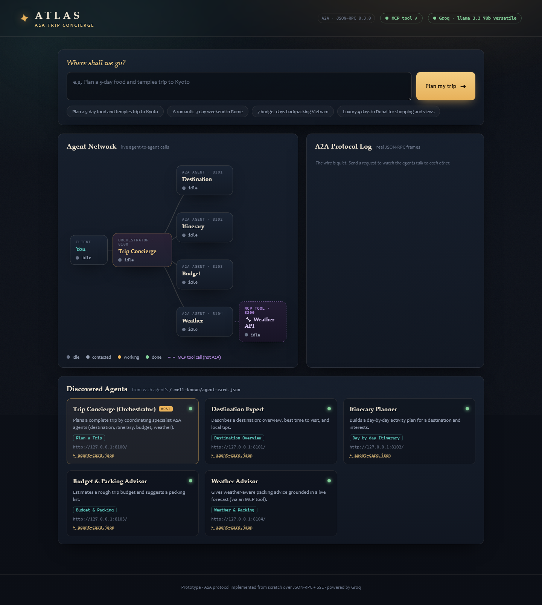
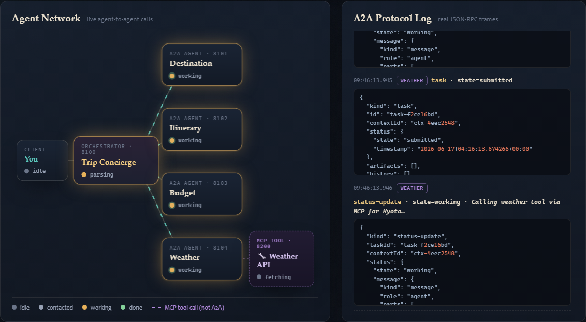
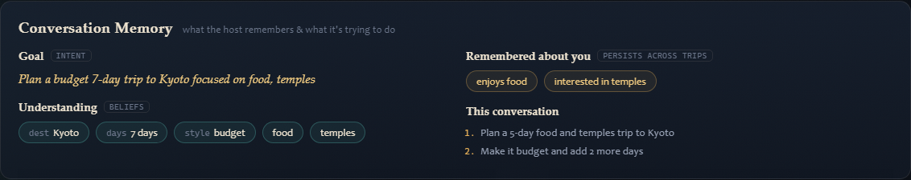

# Walkthrough — run it and read the protocol live

A guided first run. By the end you'll have watched real agent‑to‑agent messages
fly and be able to read them yourself.

---

## 0. Pre‑flight (once)

```powershell
# from the project folder
copy .env.example .env          # then paste your Groq key into .env
.\.venv\Scripts\python -m pip install -r requirements.txt   # if not already done
```

No Groq key? You can still do the whole walkthrough — the app runs in **offline
mock mode** and the badge will say so.

---

## 1. Start everything

```powershell
.\.venv\Scripts\python launch.py
```

You'll see each agent come up, then your browser opens at
**http://127.0.0.1:8000**. Leave this terminal open; **Ctrl+C** stops everything.

On screen, before you do anything:



- **Top‑right badges** tell you the mode: `Groq · llama‑3.3‑70b‑versatile` (or
  `offline mock`) and `MCP tool ✓` (the live weather tool server).
- **Agent Network**: the `You → Host Agent → 4 specialists` graph, plus a dashed
  **violet** link from the Weather agent to a `🔧 Weather API` **MCP tool** node.
  All *idle* until you send a request.
- **Discovered Agents** (bottom): the **orchestrator's own** Agent Card (badged
  **HOST**) plus the four specialist cards, fetched live from each
  `/.well-known/agent-card.json`. Click **▸ agent-card.json** to see the raw JSON.

---

## 2. Plan a trip

Type a request (or click an example chip), e.g.:

> *Plan a 4‑day art and food trip to Florence*

Hit **Plan my trip** and watch the network update together:



1. The **Host Agent** turns amber (`parsing`), then the specialist nodes go
   `ready` → `working` (pulsing) → `done` (green).
2. When the **Weather** agent runs, the dashed **violet** link to the `🔧 Weather
   API` tool lights up — that's the **MCP** call fetching a live forecast.
3. The **A2A Protocol Log** fills with the *actual* JSON‑RPC frames.
4. Each **Agent Response** card fills in with that specialist's answer.
5. Finally the **boarding‑pass trip plan** appears — the host's synthesis (its
   Weather section uses the *real* numbers the MCP tool returned).

When it's finished, every node is green, and the **Conversation Memory** panel
now shows the goal, the beliefs, and what it remembered about you.

---

## 2½. Ask a follow‑up (multi‑turn memory)

Now type a follow‑up into the *same* box, e.g.:

> *Make it budget and add 2 more days*

Watch what happens — this is the memory/intent layer:



- The **beliefs** update (days `5 → 7`, style `→ budget`) — it *remembered* Kyoto
  and your interests instead of starting over.
- The log shows **`Coordination → running … · reusing cached: …`**: only the
  affected agents re‑run; the rest show **“reused (cached)”** in violet.
- Anything durable it learned (e.g. *“enjoys food”*) lands under **Remembered
  about you** and survives even a server restart.

Hit **＋ New trip** to start a fresh conversation (your preferences are kept).

---

## 3. Read the Protocol Log (the whole point)

The log is a live transcript of the A2A conversation. Here's how to read the key
lines:

**Discovery** — the host learned each agent's capabilities from its card:
```
host  Discovered 4 agents via their /.well-known/agent-card.json
      [ { "name": "Destination Expert", "url": "http://127.0.0.1:8101/",
          "skills": ["destination_overview"] }, ... ]
```

**Delegation** — the host opens a streaming task on a specialist:
```
destination  Host → Destination Expert   message/stream: "Tell me about Florence ..."
```

**Streaming events** — the specialist's task lifecycle, one frame each:
```
destination  task            · state=submitted
destination  status-update   · state=working · "Researching the destination..."
destination  artifact-update · 945 chars
destination  status-update   · state=completed · final
```
That `final` flag on the last frame is how the client knows the task is done.

**Synthesis & finish**:
```
host  Combining all agent responses into one trip plan…
host  Final trip plan ready ✓
```

> 💡 Notice the four specialists interleave — they're running **in parallel**,
> so you'll often see `itinerary working` between two `budget` frames. Watch for
> the Weather agent's `Calling weather tool via MCP…` note too.

---

## 4. Same thing, in the terminal

Want it headless? With the agents still running (from `launch.py`), open another
terminal:

```powershell
.\.venv\Scripts\python cli.py "7 budget days backpacking Vietnam"
```

You'll get the same orchestration, printed as a colourised log, ending with the
final plan rendered as Markdown.

---

## 5. See the raw wire format

For the clearest possible look at A2A, run:

```powershell
.\.venv\Scripts\python show_protocol.py
```

It makes three raw HTTP calls to one agent and prints the exact JSON:

1. **Discovery** — the full Agent Card.
2. **`message/send`** — prints the request you POST *and* the Task you get back.
3. **`message/stream`** — prints each SSE frame as it arrives.

Read that output next to [`common/a2a.py`](../common/a2a.py) and the protocol
will “click”.

---

## 6. Hire the whole crew as one agent (composition)

The orchestrator is itself an A2A agent. Call it directly:

```powershell
.\.venv\Scripts\python show_composition.py "Plan a 5-day food trip to Kyoto"
```

You make **one** A2A call; it coordinates the four specialists internally and
returns the finished plan. More: [MCP_AND_COMPOSITION.md](MCP_AND_COMPOSITION.md).

---

## 7. Things to try

- **Click “▸ agent-card.json”** on a discovered‑agent card — that JSON *is* A2A
  discovery. Try the **HOST** card too: the orchestrator advertises a `plan_trip` skill.
- **Stop one agent** (kill port 8102) and plan again: the host reports it
  unavailable but still finishes with the other three (graceful degradation).
- **Stop the MCP server** (kill port 8200): the Weather agent can't fetch live
  data, so it gives general seasonal guidance — the plan still completes, and the
  badge shows `MCP tool offline`.
- **Switch models**: set `GROQ_MODEL=llama-3.1-8b-instant` in `.env` — faster.
- **Force mock mode** (set `ATLAS_FORCE_MOCK=1`, no need to touch `.env`) and
  re‑run: identical A2A + MCP flow, now with labelled mock answers — proof the
  protocol/tool and the “brain” are separate (the weather forecast stays *real*,
  because Open‑Meteo needs no key).
- **Memory survives a restart**: after a couple of turns, **Ctrl+C** the launcher,
  run `python launch.py` again, and reload the page — your conversation and
  remembered preferences come back (they're in `data/atlas.db`).
- **Efficient follow‑ups**: ask *“make it cheaper”* — only Budget + Itinerary
  re‑run; the others say *“reused (cached)”*. (Delete `data/atlas.db` to wipe all memory.)
- **Multi‑turn in the terminal**: `python cli.py "5-day trip to Lisbon"` then type
  follow‑ups at the prompt — same conversation, with memory.
- **Add a fifth agent** following [ARCHITECTURE.md](ARCHITECTURE.md#extending-it-add-a-5th-specialist).

---

Next: the concepts in [A2A_EXPLAINED.md](A2A_EXPLAINED.md) · memory & intent in
[MEMORY_AND_INTENT.md](MEMORY_AND_INTENT.md) · the code map in
[ARCHITECTURE.md](ARCHITECTURE.md).
